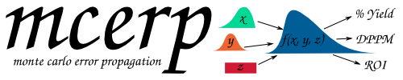

# `mcerp`



Real-time latin-hypercube-sampling-based Monte Carlo error propagation for
Python.

`mcerp` is a stochastic calculator for uncertainty analysis. It represents
inputs as probability distributions, samples them with Latin hypercube
sampling, and carries those samples through ordinary Python calculations. The
result is another uncertain value whose mean, variance, skewness, and kurtosis
can be inspected directly.

If you are familiar with Excel-based risk analysis programs like *@Risk*,
*Crystal Ball*, *ModelRisk*, etc., this package **will work wonders** for you
(and probably even be faster!) and give you more modelling flexibility with
the powerful Python language. This package also *doesn't cost a penny*,
compared to those commercial packages which cost *thousands of dollars* for a
single-seat license. Feel free to copy and redistribute this package as much
as you desire!

Use it when a model is easier to express as code than as a closed-form error
formula:

- manufacturing tolerance stack-ups
- engineering calculations with uncertain measurements
- reliability and risk calculations
- probability estimates from simulated outputs
- quick exploration of how input uncertainty changes a result

## Why `mcerp`?

`mcerp` lets you write calculations almost as if every uncertain input were an
ordinary number:

```python
from mcerp import Exp, N

x1 = N(24, 1)
x2 = N(37, 4)
x3 = Exp(2)

Z = (x1 * x2**2) / (15 * (1.5 + x3))
Z.describe()
```

The output summarizes the distribution produced by the calculation:

```text
MCERP Uncertain Value:
 > Mean...................  1161.35518507
 > Variance...............  116688.945979
 > Skewness Coefficient...  0.353867228823
 > Kurtosis Coefficient...  3.00238273799
```

## Main Features

1. Transparent uncertainty propagation through normal arithmetic.
2. Constructors for common continuous and discrete probability distributions.
3. Support for many mathematical functions through `mcerp.umath`.
4. Probability calculations with comparison operators such as `<`, `>=`, and
   `==`.
5. Correlation enforcement and correlation matrix utilities.
6. Optional distribution plotting with Matplotlib.
7. Direct compatibility with `scipy.stats` distributions through `uv(...)`.

## Documentation

- [Theory](theory.md) explains Monte Carlo propagation, Latin hypercube
  sampling, moments, and correlations.
- [Installation](installation.md) shows package installation options.
- [Quickstart](quickstart.md) walks through the core workflow.
- [API Reference](api.md) lists the public constructors and helpers.
- [References](references.md) collects the source material and related
  projects.
